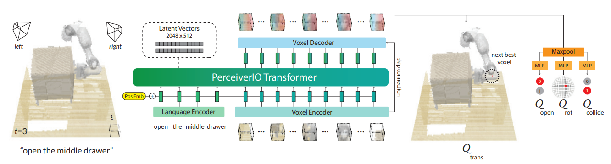
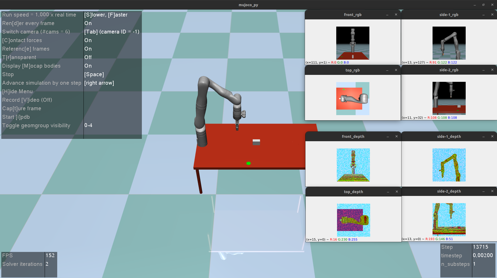
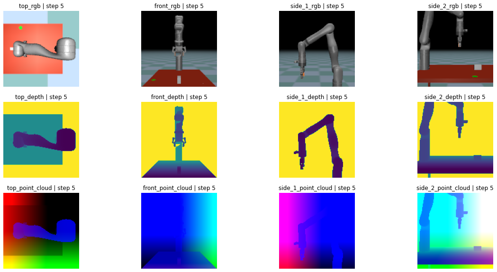
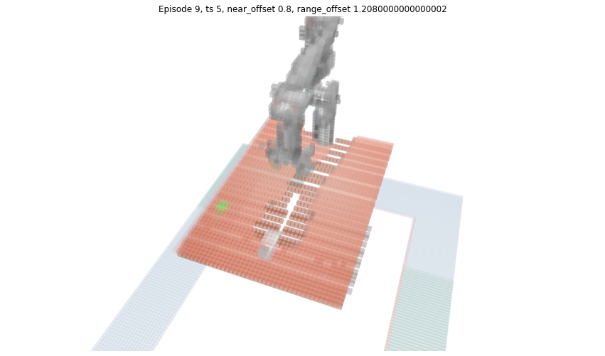

# Perceiver-Actor in MuJoCo simulation

This repo holds a robotic arm implementation of the PerAct behavorial learning technique runnning on MuJoCo. The detail of PerAct can be found in the following repository [Perceiver-Actor](https://github.com/peract/peract). In short, the robot model can perform a specific task based on the user language command (open drawers, pick up objects,...).



To achieve this, there are several steps. First, a simulator is needed to simulate the robot environment. In this project, we use [MuJoCo](http://www.mujoco.org/) as the simulator. In the simulator, there are several cameras that capture the robot scene in RGB and depth images. Then, the visual data of RGB and depth is converted into a 3D representation of the scene with [voxels](https://en.wikipedia.org/wiki/Voxel)... (Work in progress)

## Running the simulator

In this project, the 3D presentation of the robot scene is converted into a [Voxel](https://en.wikipedia.org/wiki/Voxel) presentation, before the voxels are fed into the PerAct model. In order to start the simulator, please run this following command

```bash
./start.script
```
<strong>Explanation: </strong> First, the script copies the robot model files into the MuJoCo reading folder at <strong><em>/tmp</em></strong>. Then, it adds several variables (<strong><em>LD_LIBRARY_PATH, LD_PRELOAD</em></strong>) to the environment. Lasty, it runs the MuJoCo simulator with the main robot model at (<strong><em>./3dmodel/robot_2023_1_17_12_17_30.xml</em></strong>).

After running the command, the MuJoCo simulator should show the following.



## Running the 3D transformation in voxels

The Voxelization.ipynb and Voxel_Calibration.ipynb files are Python notebooks that are used to convert the RGB and depth images into voxels. The Voxelization.ipynb file is used to convert the RGB and depth images into voxels. The Voxel_Calibration.ipynb file is used to calibrate the RGB and depth images to the robot model. You should see the following result after running the Voxelization.ipynb and Voxel_Calibration.ipynb files.

Here are the images input for the voxelization.



Here is the voxelization result.




<!-- The calibration is done by using the [OpenCV](https://opencv.org/) library. -->